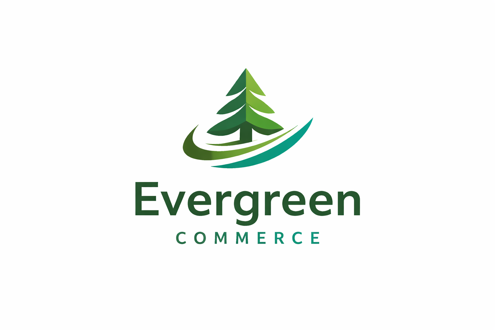
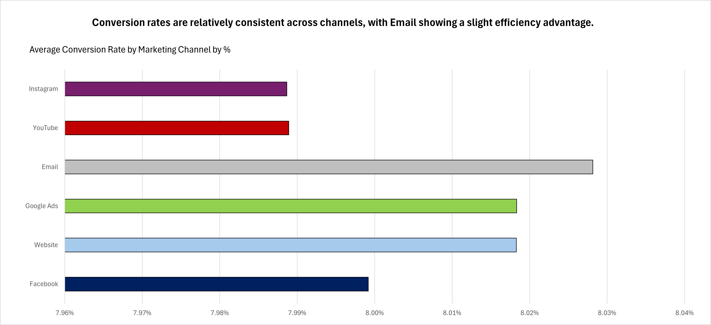
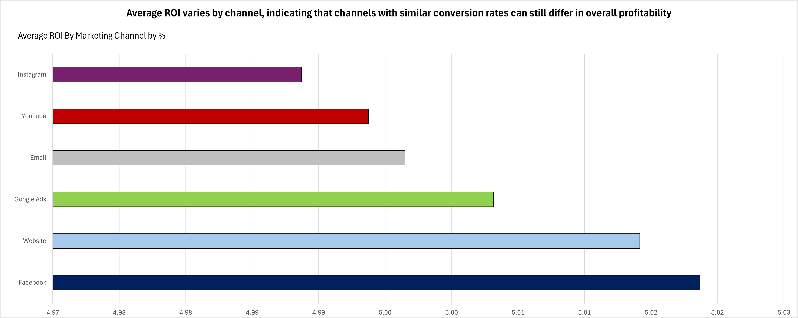
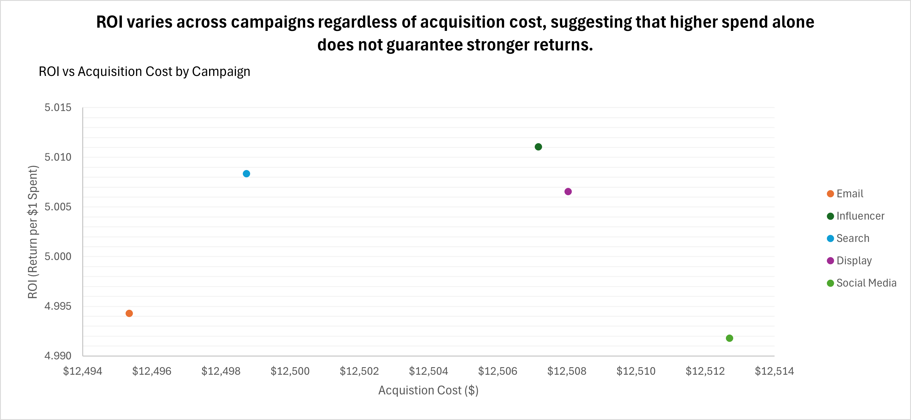
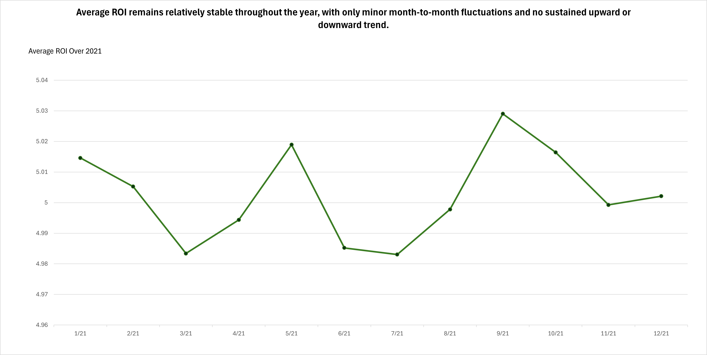

## Table of Contents
- [Background and Overview](#background-and-overview)
- [Dataset Overview](#data-structure-overview)
- [Executive Summary](#executive-summary)
- [Key Insights](#insights-deep-dive)
- [Insights to Action](#recommendations)

## Background and Overview
Evergreen Commerce is a fictional U.S.-based consumer e-commerce company that relies heavily on digital marketing to drive customer acquisition and revenue growth. Operating in a competitive online retail environment, the company invests across multiple digital channels including email, paid search, social media, display advertising, and influencer partnerships.

As marketing spend increases, leadership must evaluate whether campaign investments are translating into meaningful returns. While conversion metrics provide insight into customer engagement, they do not always reflect overall profitability. This project analyzes Evergreen Commerce’s marketing campaign performance to evaluate channel efficiency, return on investment (ROI), acquisition cost tradeoffs, and performance stability over time.

Insights from this analysis are grouped into the following key areas:

- **Conversion Efficiency** – How conversion rates compare across digital marketing channels.
- **Profitability by Channel** – Whether higher conversion rates translate into stronger ROI.
- **Acquisition Cost vs ROI** – The relationship between campaign spend and financial return.
- **Performance Over Time** – Whether ROI remains stable or trends upward or downward across the year.

## Dataset Overview 
This analysis uses the Kaggle Marketing Campaign Performance Dataset, which contains 200,000 campaign records spanning a two year period. Each row represents an individual digital marketing campaign and includes performance metrics, targeting attributes, financial measures, and time based data.

Key variables include campaign type, marketing channel used, target audience, customer segment, conversion rate, acquisition cost, return on investment (ROI), clicks, impressions, engagement score, and campaign date. These fields provide both efficiency based indicators such as conversion rate and engagement, as well as profitability focused measures such as acquisition cost and ROI.

While the dataset reflects campaigns across multiple fictional companies, it was scoped and analyzed as if representing a single consumer e commerce business, referred to in this project as Evergreen Commerce. This approach allows for focused evaluation of channel performance, campaign level efficiency, and ROI trends over time within a consistent business context.

This combination of campaign level financial and performance metrics enables a structured assessment of marketing efficiency, profitability, and stability across digital channels.

The dataset that was used can be found here: [Kaggle Marketing Campaign Performance Dataset](https://www.kaggle.com/datasets/manishabhatt22/marketing-campaign-performance-dataset)

## Executive Summary
### Summary 
Evergreen Commerce’s marketing campaigns demonstrate relatively consistent conversion efficiency across digital channels, with Email showing a modest advantage. However, profitability varies more meaningfully than conversion rate alone would suggest. Channels with similar conversion performance do not always generate equivalent return on investment (ROI), highlighting the importance of evaluating financial outcomes alongside engagement metrics.

At the campaign level, acquisition cost does not reliably predict ROI. Campaigns with comparable spend levels can produce different returns, indicating that strategic execution and channel selection influence profitability more than budget size alone. Additionally, ROI remained stable throughout the year, with only minor month to month fluctuations and no sustained upward or downward trend.

Overall, the findings suggest that Evergreen Commerce should focus on optimizing channel mix and campaign execution rather than increasing marketing spend across the board. A balanced evaluation of efficiency and profitability is essential for data driven budget allocation.

## Key Insights
### Conversion Efficiency by Channel

**Average Conversion Rate (Graph)**
- Conversion rates are relatively consistent across digital marketing channels ranging from approximately 7.99% to 8.03%.
- Email campaigns show the highest average conversion rate at approximately 8.03%, while Instagram and YouTube are slightly lower at roughly 7.99%
- The total spread between the highest and lowest performing channels is under 0.05 percentage points, indicating minimal variation in pure conversion efficiency.
- The total spread between the highest and lowest performing channels is under 0.05 percentage points, indicating minimal variation in pure conversion efficiency.

### Profitability by Channel 

**Average ROI by Marketing Channel (Graph)**
- Average ROI ranges from approximately 4.99 to 5.02 across channels.
- Average ROI ranges from approximately 4.99 to 5.02 across channels.
- Despite near-identical conversion rates, financial returns vary modestly across channels.
- This suggests that cost structure and campaign execution influence profitability beyond conversion efficiency alone.

### Acquisition Cost vs ROI

**Campaign-Level Efficiency Tradeoff (Graph)**
- Average acquisition costs across campaign types range from approximately $12,481 to $12,528.
- ROI across campaign strategies remains within a narrow band of roughly 4.99 to 5.01.
- Campaigns with similar spend levels demonstrate small but measurable differences in ROI.
- Increased acquisition cost does not consistently produce higher returns, reinforcing that strategic execution plays a greater role than budget size alone.

### ROI Over Time

**Monthly ROI Trend (Graph)
- Monthly average ROI fluctuates within a tight range of approximately 4.99 to 5.02 throughout the year.
- Variation remains minimal, with no sustained upward or downward trend.
- Performance consistency suggests steady campaign execution rather than volatility.
- Incremental optimization may be more impactful than major structural changes.

## Insights to Action
